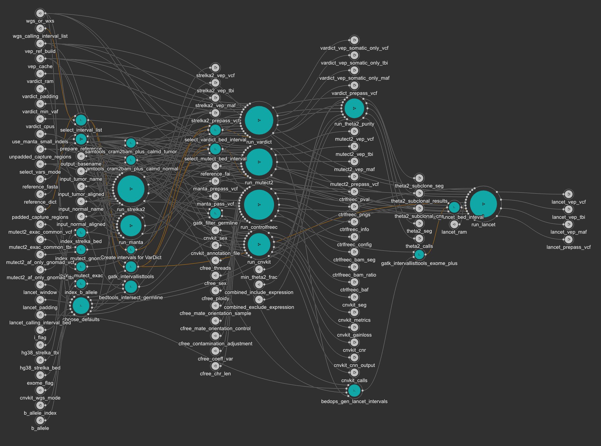

# Kids First DRC Somatic Variant Workflow

This repository contains the Kids First Data Resource Center (DRC) Somatic Variant Workflow, which includes somatic variant (SNV), copy number variation (CNV), and structural variant (SV) calls.
This workflow takes aligned cram input and performs somatic variant calling using Strelka2, Mutect2, Lancet, and VarDict Java, CNV estimation using ControlFreeC and CNVkit, and SV calls using Manta.
Somatic variant and SV call results are annotated using Variant Effect Predictor, with the Memorial Sloane Kettering Cancer Center (MSKCC) vcf2maf wrapper.

If you would like to run this workflow using the cavatica public app, a basic primer on running public apps can be found [here](https://www.notion.so/d3b/Starting-From-Scratch-Running-Cavatica-af5ebb78c38a4f3190e32e67b4ce12bb).
Alternatively, if you'd like to run it locally using `cwltool`, a basic primer on that can be found [here](https://www.notion.so/d3b/Starting-From-Scratch-Running-CWLtool-b8dbbde2dc7742e4aff290b0a878344d) and combined with app-specific info from the readme below.
This workflow is the current production workflow, equivalent to this [Cavatica public app](https://cavatica.sbgenomics.com/public/apps#cavatica/apps-publisher/kfdrc-somatic-variant-workflow)

## Running WGS or WXS

The [combinded workflow](https://github.com/kids-first/kf-somatic-workflow/blob/master/workflow/kfdrc-somatic-variant-workflow.cwl) is designed to be able to process either WGS or WXS inputs.
This functionality comes from usage of the `wgs_or_wxs` input enum. Depending on what is provided for this input, the tool will
set the appropriate default values and check that the user has provided the correct inputs. For example, if the user sets the
input to WGS the lancet_padding value will be defaulted to 300; alternatively, if the user sets the input to WXS the lancet_padding
value will be defaulted to 0. In either case, the user can override the defaults simply by providing their own value for lancet_padding
in the inputs.

The `wgs_or_wxs` flag also controls which inputs are used for certain steps. For example, the bed_interval input for Lancet comes
from different sources in the WGS and WXS pipelines. In the WGS pipeline separate processing is done ahead of time to generate
a new interval file. A tool in the workflow will take in the presumptive inputs for WGS and WXS modes. If the mode is WGS, then
the pipeline will pass on the file provided as the wgs_input and vice versa. If the wgs_input is missing and the mode is WGS, then
the pipeline will fail.

### WGS-only Fields

There are two WGS only fields `wgs_calling_interval_list` and `lancet_calling_interval_bed`. If these are not provided in a WGS run,
the pipeline will fail.

### WXS-only Fields

There are two WXS only fields `padded_capture_regions` and `unpadded_capture_regions`. If these are not provided in a WXS run,
the pipeline will fail.

### Standalone Somatic Workflows
Each tool used in the [combined workflow](https://github.com/kids-first/kf-somatic-workflow/blob/master/workflow/kfdrc-somatic-variant-workflow.cwl) can be run on its own. While the combined workflow calls all types of variant, each standalone caller only specializes in one class of variant.

| Workflow                                                                                                                                            | CNV | SNV | SV |
|-----------------------------------------------------------------------------------------------------------------------------------------------------|-----|-----|----|
| [kfdrc-somatic-variant-workflow.cwl](https://github.com/kids-first/kf-somatic-workflow/blob/master/workflow/kfdrc-somatic-variant-workflow.cwl)     |  x  |  x  |  x |
| [kfdrc_production_cnvkit_wf.cwl](https://github.com/kids-first/kf-somatic-workflow/blob/master/workflow/kfdrc_production_cnvkit_wf.cwl)             |  x  |     |    |
| [kfdrc_production_controlfreec_wf.cwl](https://github.com/kids-first/kf-somatic-workflow/blob/master/workflow/kfdrc_production_controlfreec_wf.cwl) |  x  |     |    |
| [kfdrc_production_lancet_wf.cwl](https://github.com/kids-first/kf-somatic-workflow/blob/master/workflow/kfdrc_production_lancet_wf.cwl)             |     |  x  |    |
| [kfdrc_production_manta_wf.cwl](https://github.com/kids-first/kf-somatic-workflow/blob/master/workflow/kfdrc_production_manta_wf.cwl)               |     |     |  x |
| [kfdrc_production_mutect2_wf.cwl](https://github.com/kids-first/kf-somatic-workflow/blob/master/workflow/kfdrc_production_mutect2_wf.cwl)           |     |  x  |    |
| [kfdrc_production_strekla2_wf.cwl](https://github.com/kids-first/kf-somatic-workflow/blob/master/workflow/kfdrc_production_strekla2_wf.cwl)         |     |  x  |    |
| [kfdrc_production_theta2_wf.cwl](https://github.com/kids-first/kf-somatic-workflow/blob/master/workflow/kfdrc_production_theta2_wf.cwl)             |     |     |  x |
| [kfdrc_production_vardict_wf.cwl](https://github.com/kids-first/kf-somatic-workflow/blob/master/workflow/kfdrc_production_vardict_wf.cwl)           |     |  x  |    |

#### SNV Callers

- [Strelka2](https://github.com/Illumina/strelka) `v2.9.3` calls single nucleotide variants (SNV) and insertions/deletions (INDEL).
- [Mutect2](https://gatk.broadinstitute.org/hc/en-us/articles/360036730411-Mutect2) `v4.1.1.0` from the Broad institute calls SNV, multi-nucleotide variants (MNV, basically equal length substitutions with length > 1) and INDEL.
- [Lancet](https://github.com/nygenome/lancet) `v1.0.7` from the New York Genome Center (NYGC) calls SNV, MNV, and INDEL.
- [VarDict Java](https://github.com/AstraZeneca-NGS/VarDictJava) `v1.7.0` from AstraZeneca calls SNV, MNV, INDEL and more.

Each caller has a different approach to variant calling, and together one can glean confident results. Strelka2 is run with default settings, similarly Mutect2 following Broad Best Practices, as of this [workflow](https://github.com/broadinstitute/gatk/blob/4.1.1.0/scripts/mutect2_wdl/mutect2.wdl). Lancet is run in what I'd call an "Exome+" mode, based on the NYGC methods described [here](https://www.biorxiv.org/content/biorxiv/early/2019/04/30/623702.full.pdf). In short, regions from GENCODE gtf with feature annotations `exon`, `UTR`, and start/stop `codon` are used as intervals, as well as regions flanking hits from `strelka2` and `mutect2`. Lastly, VarDict Java run params follow the protocol that the [Blue Collar Bioinformatics](https://bcbio-nextgen.readthedocs.io/en/latest/index.html) uses, with the exception of using a min variant allele frequency (VAF) of 0.05 instead of 0.1, which we find to be relevant for rare cancer variant discovery. We also employ their false positive filtering methods.
Furthermore, each tool's results, in variant call format (vcf), are filtered on the `PASS` flag, with VarDict Java results additionally filtered for the flag `StrongSomatic`. Their results also include germline hits and other categories by default.
The pre-`PASS` filtered results can still be obtained from the workflow in the event the user wishes to keep some calls that failed `PASS` criteria.

#### CNV Estimators

- [ControlFreeC](https://github.com/BoevaLab/FREEC) `v11.6` is used for CNV estimation.
The tool portion of the workflow is a port from the [Seven Bridges Genomics](https://www.sevenbridges.com/) team, with a slight tweak in image outputs.
Also, the workflow wrapper limits what inputs and outputs are used based on our judgement of utility.
Outputs include raw ratio calls, copy number calls with p values assigned, b allele frequency data, as well as copy number and b allele frequency plots.
- [CNVkit](https://cnvkit.readthedocs.io/en/stable/) `v2.9.3` is a CNV second tool we currently use.
- [THeTa2](https://github.com/raphael-group/THetA) is used to inform and adjust copy number calls from CNVkit with purity estimations.

For ControlFreeC and CNVkit, we take advantage of b allele frequency (from the gVCF created by our [alignment and haplotypecaller workflows](https://github.com/kids-first/kf-alignment-workflow)) integration for copy number genotype estimation and increased CNV accuracy.

#### SV Callers

- [Manta](https://github.com/Illumina/manta) `v1.4.0` is used to call SVs. Output is also in vcf format, with calls filtered on `PASS`.
Default settings are used at run time.

#### Variant Annotation

- [Variant Effect Predictor](https://useast.ensembl.org/info/docs/tools/vep/index.html) `release 93`, wrapped by [vcf2maf](https://github.com/mskcc/vcf2maf) `v1.6.17` is used to annotate somatic variant and SV calls.

Both the annotated vcf and maf file are made available.

### Tips to Run:

1. For input cram files, be sure to have indexed them beforehand as well.

1. For ControlFreeC, it is highly recommended that you supply a vcf file with germline calls, GATK Haplotype caller recommended.
Please also make sure the index for this file is available.
Also, a range of input ploidy possibilities for the inputs are needed. You can simply use `2`, or put in a range, as an array, like 2, 3, 4.
For mate orientation, you will need to specify, the drop down and tool doc explains your options.

1. As a cavatica app, default references for hg38 are already pre-populated, as well as some default settings - i.e., number of threads, coefficient of variation input for ControlFreec, and `PASS` filter tool mode.

1. What is `select_vars_mode` you ask? On occasion, using GATK's `SelectVariants` tool will fail, so a simple `grep` mode on `PASS` can be used instead.
Related, `bcftools_filter_vcf` is built in as a convenience in case your b allele frequency file has not been filtered on `PASS`.
You can use the `include_expression` `Filter="PASS"` to achieve this.

1. Suggested reference inputs are:

    - `reference_fasta`: [Homo_sapiens_assembly38.fasta](https://console.cloud.google.com/storage/browser/genomics-public-data/resources/broad/hg38/v0?pli=1) - need a valid google account, this is a link to the resource bundle from Broad GATK
    - `reference_dict`: [Homo_sapiens_assembly38.dict](https://console.cloud.google.com/storage/browser/genomics-public-data/resources/broad/hg38/v0?pli=1) - need a valid google account, this is a link to the resource bundle from Broad GATK
    - `annotation_file`: [refFlat_HG38.txt](http://hgdownload.soe.ucsc.edu/goldenPath/hg38/database/refFlat.txt.gz) gunzip this file from UCSC.  Needed for gene annotation in `CNVkit`
    - `wgs_calling_interval_list`: [wgs_calling_regions.hg38.interval_list](https://console.cloud.google.com/storage/browser/genomics-public-data/resources/broad/hg38/v0?pli=1) - need a valid google account, this is a link to the resource bundle from Broad GATK.*To create our 'wgs_canonical_calling_regions.hg38.interval_list', edit this file* by leaving only entries related to chr 1-22, X,Y, and M.M may need to be added.
    - `lancet_calling_interval_bed`: `GRCh38.gencode.v31.CDS.merged.bed`.  As decribed at the beginning, for WGS, it's highly recommended to use CDS bed, and supplement with region calls from strelka2 & mutect2. Our reference was obtained from GENCODE, [release 31](https://www.gencodegenes.org/human/release_31.html) using this gtf file [gencode.v31.primary_assembly.annotation.gtf.gz](ftp://ftp.ebi.ac.uk/pub/databases/gencode/Gencode_human/release_31/gencode.v31.primary_assembly.annotation.gtf.gz) and parsing features for `UTR`, `start codon`, `stop codon`, and `exon`, then using bedtools sort and merge after converting coordinates into bed format.
    - `af_only_gnomad_vcf`: [af-only-gnomad.hg38.vcf.gz](https://console.cloud.google.com/storage/browser/-gatk-best-practices/somatic-hg38) - need a valid google account, this is a link to the best practices google bucket from Broad GATK.
    - `exac_common_vcf`: [small_exac_common_3.hg38.vcf.gz](https://console.cloud.google.com/storage/browser/gatk-best-practices/somatic-hg38) - need a valid google account, this is a link to the best practices google bucket from Broad GATK.
    - `hg38_strelka_bed`: [hg38_strelka.bed.gz'](https://github.com/Illumina/strelka/blob/v2.9.x/docs/userGuide/README.md#extended-use-cases) - this link here has the bed-formatted text needed to copy to create this file. You will need to bgzip this file.
     - `vep_cache`: `homo_sapiens_vep_93_GRCh38.tar.gz` from ftp://ftp.ensembl.org/pub/release-93/variation/indexed_vep_cache/ - variant effect predictor cache.
     Current production workflow uses this version, and is compatible with the release used in the vcf2maf tool.
     - `threads`: 16
     - `chr_len`: hs38_chr.len, this a tsv file with chromosomes and their lengths. Should be limited to canonical chromosomes
      The first column must be chromosomes, optionally the second can be an alternate format of chromosomes.
      Last column must be chromosome length.
      Using the `hg38_strelka_bed`, and removing chrM can be a good source for this.
    - `coeff_var`: 0.05
    - `contamination_adjustment`: FALSE

1. Output files (Note, all vcf files that don't have an explicit index output have index files output as as secondary file.  In other words, they will be captured at the end of the workflow):

    - Simple variant callers
        - Strelka2:
            - `strelka2_vep_vcf`: Variant effect predictor annotated vcf, filtered on `PASS`, somatic snv and indel call results from strelka2
            - `strelka2_vep_tbi`: Index file of above bgzipped vcf
            - `strelka2_prepass_vcf`: Somatic snv and indel call results with all `FILTER` categories for strelka2. Use this file if you believe important variants are being left out when using the algorithm's `PASS` filter.
            - `strelka2_vep_maf`: Mutation annotation file (maf) format of `strelka2_vep_vcf`
        - Mutect2:
            - `mutect2_vep_vcf`: Variant effect predictor annotated vcf, filtered on `PASS`, somatic snv and indel call results from mutect2
            - `mutect2_vep_tbi`: Index file of above bgzipped vcf
            - `mutect2_prepass_vcf`: Somatic snv and indel call results with all `FILTER` categories for mutect2. Use this file if you believe important variants are being left out when using the algorithm's `PASS` filter.
            - `mutect2_vep_maf`: maf of format of `mutect2_vep_vcf`
        - VardictJava
            - `vardict_vep_somatic_only_vcf`: Variant effect predictor annotated vcf, filtered on `PASS` and `StrongSomatic` call results from VardictJava
            - `vardict_vep_somatic_only_tbi`: Index file of above bgzipped vcf
            - `vardict_vep_somatic_only_maf`: maf format of `vardict_vep_somatic_only_vcf`
            - `vardict_prepass_vcf`: All call results with all `FILTER` categories for VardictJava. Use this file if you believe important variants are being left out when using the algorithm's `PASS` filter and our `StrongSomatic` subset.
        - Lancet
            - `lancet_vep_vcf`: Variant effect predictor annotated vcf, filtered on `PASS`, somatic snv and indel call results from lancet
            - `lancet_vep_tbi`: Index file of above bgzipped vcf
            - `lancet_vep_maf`: maf format of `lancet_vep_vcf`
            - `lancet_prepass_vcf`: Somatic snv and indel call results with all `FILTER` categories for lancet. Use this file if you believe important variants are being left out when using the algorithm's `PASS` filter.
    - Structural variant callers
        - Manta
            - `manta_vep_vcf`: Variant effect predictor annotated vcf, filtered on `PASS`, sv call results from manta
            - `manta_vep_tbi`: Index file of above bgzipped vcf
            - `manta_prepass_vcf`: SV results with all `FILTER` categories for manta. Use this file if you believe important variants are being left out when using the algorithm's `PASS` filter.
            - `manta_vep_maf`: maf of format of `manta_vep_vcf`
    - Copy number variation callers
        - ControlFREEC
            - `ctrlfreec_pval`: CNV calls with copy number and p value confidence, a qualtitative "gain, loss, neutral" assignment, and genotype with uncertainty assigned from ControlFreeC.  See author manual for more details.
            - `ctrlfreec_config`: Config file used to run ControlFreeC.  Has some useful information on what parameters were used to run the tool.
            - `ctrlfreec_pngs`: Plots of b allele frequency (baf) log2 ratio and ratio of tumor/normal copy number coverage.  Pink line in the middle of ratio plots is the median ratio.
            - `ctrlfreec_bam_ratio`: Bam ratio text file.  Contain ratio, median ratio (used to inform `ctrlfreec_pval`), cnv estimates, baf estimate, and genotype estimate.
            - `ctrlfreec_bam_seg`: In-house generated seg file based on ratio file.  Provided asa a convenience for compatibility with tools that require inputs in legacy microarray format.
            - `ctrlfreec_baf`: baf estimations.
            - `ctrlfreec_info`: Contains useful run time information, like ploidy used for analysis, and window size
        - CNVkit
            - `cnvkit_cnr`: Copy number ratio
            - `cnvkit_cnn_output`: Normal/control sample copy number
            - `cnvkit_calls`: Tumor/sample copy number
            - `cnvkit_metrics`: Basic seg count and call stats
            - `cnvkit_gainloss`: Per-gene log2 ratio
            - `cnvkit_seg`: Classic microarray-style seg file
            - `theta2_calls`: Purity-adjusted CNVkit copy number calls based on theta2 results
            - `theta2_seg`: Purity-adjusted CNVkit seg file based on theta results
            - `theta2_subclonal_results`: Theta2 Subclone purity results
            - `theta2_subclonal_cns`: Theta2 sublone cns
            - `theta2_subclone_seg`: Theta subclone seg file

1. Docker images - the workflow tools will automatically pull them, but as a convenience are listed below:
    - `Strelka2`: pgc-images.sbgenomics.com/d3b-bixu/strelka
    - `Mutect2` and all `GATK` tools: pgc-images.sbgenomics.com/d3b-bixu/gatk:4.1.1.0
    - `Lancet`: pgc-images.sbgenomics.com/d3b-bixu/lancet:1.0.7
    - `VarDict Java`: pgc-images.sbgenomics.com/d3b-bixu/vardict:1.7.0
    - `ControlFreeC`: images.sbgenomics.com/vojislav_varjacic/control-freec-11-6:v1
    - `CNVkit`: images.sbgenomics.com/milos_nikolic/cnvkit:0.9.3
    - `THetA2`: pgc-images.sbgenomics.com/d3b-bixu/theta2:0.7
    - `samtools`: pgc-images.sbgenomics.com/d3b-bixu/samtools:1.9
    - `Variant Effect Predictor`: pgc-images.sbgenomics.com/d3b-bixu/vep:r93_v2
    - `Manta`: pgc-images.sbgenomics.com/d3b-bixu/manta:1.4.0
    - `bcftools` and `vcftools`: pgc-images.sbgenomics.com/d3b-bixu/bvcftools:latest

1. For highly complex samples, some tools have shown themselves to require memory allocation adjustments:
   Manta, GATK LearnReadOrientationModel, GATK GetPileupSummaries, GATK FilterMutectCalls and Vardict.
   Optional inputs exist to expand the memory allocation for these jobs: manta_memory, learnorientation_memory,
   getpileup_memory, filtermutectcalls_memory, and vardict_ram, respectively.
   For the java tools (Vardict and GATK), these values represent limits on the memory that can
   be used for the respective jobs. Tasks will go to these values and not exceed it. They may succeed or fail,
   but they will not exceed the limit established. The memory allocations for these is hardcapped. The memory
   allocation option for Manta, conversely, is a soft cap. The memory requested will be allocated for the job
   on a particular machine but once the task is running on the machine it may exceed that requested value. For example,
   if Manta's memory allocation is set to 10 GB it will have 10 GB allocated to it at task creation, but, if the
   task ends up running on a machine with more memory available, the task may use it. Setting a value here for Manta
   will not prevent Manta from taking more than that value. The memory usage in Manta is limited by the machine hardware.
   As such the option for Manta memory allocation is described as soft cap. For more information on Manta resource
   usage see their [documentation](https://github.com/Illumina/manta/blob/master/docs/userGuide/README.md#runtime-hardware-requirements).

## Other Resources
- tool images: https://hub.docker.com/r/kfdrc/
- dockerfiles: https://github.com/d3b-center/bixtools

