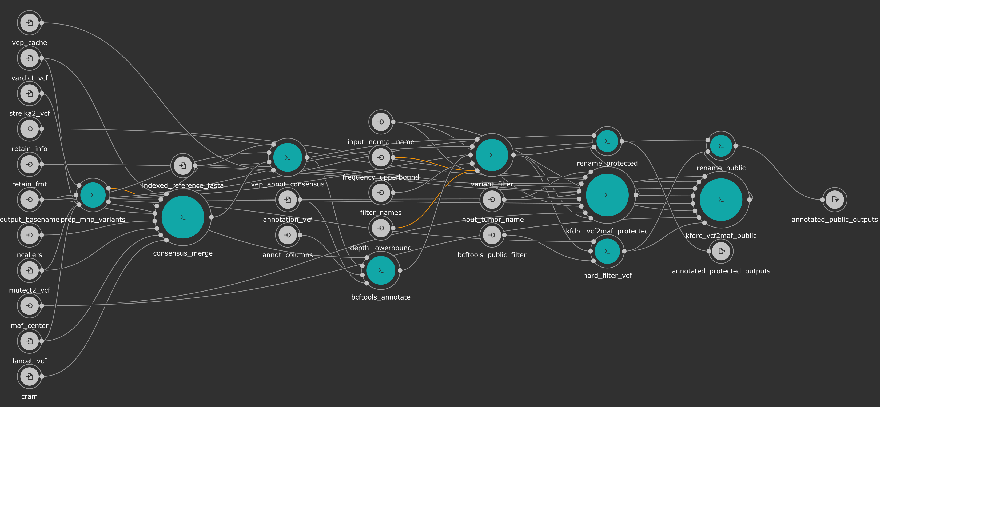

# Kids First DRC Consensus Calling Workflow
This workflow is used by the Kids First (KF) Data Resource Center (DRC) to create consensus calls from outputs generated by our somatic variant callers.


This workflow takes the protected vcf outputs from the [Kids First DRC Somatic Workflow](workflow/kfdrc-somatic-variant-workflow.cwl) and creates protected and public consensus VCF and MAF files.
The general outline is as follows:

1. Prep MNP Variants
   - Strelka2 outputs multi-nucleotide polymorphisms (MNPs) as consecutive single-nucleotide polymorphisms
   - In order preserve MNPs, we gather MNP calls from the other caller inputs, and search for evidence supporting these consecutive SNP calls as MNP candidates
    - Once found, the Strelka2 SNP calls supporting a MNP are converted to a single MNP call
    - This is done to preserve the predicted gene model as accurately as possible in our consensus calls
1. Consensus merge
   - Calls are gathered from all four callers
   - By default, calls with support from 2+ callers OR calls that are marked as `HotSpotAllele` in the `INFO` field are retained
   - Retained calls then have their `MQ` and `MQ0` values calculated from the input tumor cram
   - `GT` fields are estimated as "majority rules," and when no majority exists, set as `0/1` by default
   - `AD`, `DP`, and `AF` are calculated as the average value between callers
   - `ADR`, `DPR`, and `AFR` fields are added as the range of values from the previous point, to give the observer a sense on confidence in the value
1. VEP Annotate Consensus
1. BCF tools annotate
   - Additional annotation is performed augment VEP annotation
   - While VEP does have extensive gnomad allele frequency annotation, it is limited to exome values. The added gnomad AF only resource we use augments this as an additional `INFO/AF` field to add WGS frequencies
1. Soft filter variants
   - A soft filter is added based on criteria provided
   - By default, we perform soft filtering as outlined in the [KFDRC Annotation Subworkflow](kfdrc_annotation_subworkflow.md#workflow_description_and_kf_recommended_inputs)
1. VCF2MAF protected
   - Here, for convenience of analysis we convert the resultant, soft-filtered VCF (AKA, "Protected VCF") into MAF format
1. Hard filter VCF
   - The Protected VCF is hard filtered on `PASS` and `HotSpotAllele` for reasons outlined in the `Soft filter variants` step
   - This VCF is known as the "Public VCF"
1. VCF2MAF public
1. Rename outputs



## Workflow Description and KF Recommended Inputs

### General workflow inputs:
```yaml
inputs:
  indexed_reference_fasta: {type: File, secondaryFiles: ['.fai', '^.dict'], 
                            sbg:suggestedValue: {class: File, path: 60639014357c3a53540ca7a3, name: Homo_sapiens_assembly38.fasta,
                            secondaryFiles: [{class: File, path: 60639016357c3a53540ca7af, name: Homo_sapiens_assembly38.fasta},
                            {class: File, path: 60639019357c3a53540ca7e7, name: Homo_sapiens_assembly38.dict}]
                            }}
  strelka2_vcf: {type: File, secondaryFiles: ['.tbi']}
  mutect2_vcf: {type: File, secondaryFiles: ['.tbi']}
  lancet_vcf: {type: File, secondaryFiles: ['.tbi']}
  vardict_vcf: {type: File, secondaryFiles: ['.tbi']}
  cram: {type: File, secondaryFiles: ['.crai'], doc: "Tumor cram recommended for MQ score calculation"}
  input_tumor_name: string
  input_normal_name: string
  output_basename: string
  tool_name: {type: string?, default: "consensus_somatic", doc: "A helpful file name building component"}
  ncallers: {type: int?, doc: "Optional number of callers required for consensus [2]",
    default: 2}
  consensus_ram: {type: int, doc: "Set min memory in GB for consensus merge step", default: 3}
  annotation_vcf: {type: File, secondaryFiles: ['.tbi'], doc: "VCF of annotations to add to consensus variants, e.g. gnomAD allele frequency",
                   sbg:suggestedValue: {class: File, path: 5f50018fe4b054958bc8d2e3, name: af-only-gnomad.hg38.vcf.gz,
                   secondaryFiles: [{class: File, path: 5f50018fe4b054958bc8d2e5, name: af-only-gnomad.hg38.vcf.gz.tbi}]
                   }}
  vep_cache: {type: File, doc: "tar gzipped cache from ensembl/local converted cache",
    sbg:suggestedValue: {class: File, path: 607713829360f10e3982a425, name: homo_sapiens_vep_93_GRCh38.tar.gz}}
  annot_columns: {type: string?, default: 'INFO/AF', doc: "column from annotation_vcf to add to consensus VCF; defaults to 'INFO/AF'"}
  filter_names: {type: 'string[]?', default: [ "NORM_DP_LOW", "GNOMAD_AF_HIGH" ], doc: "Names of filters to be added to consensus VCF;\
     \ default values set"}
  depth_lowerbound: {type: int?, default: 7, doc: "Normal-sample read depth at which to apply depth filter; default set"}
  frequency_upperbound: {type: float?, default: 0.001, doc: "Population allele frequency above which to apply frequency filter; default set"}
  bcftools_public_filter: {type: string?, doc: 'Will hard filter final result to create a public version, e.g. FILTER="PASS"|INFO/HotSpotAllele=1; default set', default: 'FILTER="PASS"|INFO/HotSpotAllele=1'}
  retain_info: {type: string?, doc: "csv string with INFO fields that you want to keep; default values set", default: 'MQ,MQ0,CAL,HotSpotAllele'}
  retain_fmt: {type: string?, doc: "csv string with FORMAT fields that you want to keep"}
  maf_center: {type: string?, doc: "Sequencing center of variant called", default: "."}
```

### Recommended reference inputs - all file references can be obtained [here](https://cavatica.sbgenomics.com/u/kfdrc-harmonization/kf-references/)
Secondary files needed for each reference file will be a sub-bullet point
 - `indexed_reference_fasta`: `Homo_sapiens_assembly38.fasta`
   - `Homo_sapiens_assembly38.fasta.fai`
   - `Homo_sapiens_assembly38.dict`
 - `bcftools_annot_columns`: "INFO/AF"
 - `annotation_vcf`: `af-only-gnomad.hg38.vcf.gz`
   - `af-only-gnomad.hg38.vcf.gz.tbi`
 - `bcftools_public_filter`: 'FILTER="PASS"|INFO/HotSpotAllele=1'
 - `vep_cache`: `homo_sapiens_vep_93_GRCh38.tar.gz`
 - `tool_name`: "consensus_somatic"

### Situational inputs
 - `depth_lowerbound`: Change this `int` if you believe the threshold for `NORM_DP_LOW` should be different
 - `frequency_upperbound` Change this `float` if you believe the max value for `GNOMAD_AF_HIGH` should be different
 - `ncallers`: Change this `int` to adjust the stringency of what is defined as a consensus
 - `consensus_ram`: Change this `int` if the script runs out of memory to increase the size of the instance type used

## Workflow outputs
```yaml
outputs:
  annotated_protected_outputs: {type: 'File[]', outputSource: rename_protected/renamed_files}
  annotated_public_outputs: {type: 'File[]', outputSource: rename_public/renamed_files}

```
 - `annotated_protected_outputs`: Array of files containing MAF format of PASS hits, `PASS` VCF with annotation pipeline soft `FILTER`-added values, and VCF index
 - `annotated_public_outputs`: Same as above, except MAF and VCF have had entries with soft `FILTER` values removed
