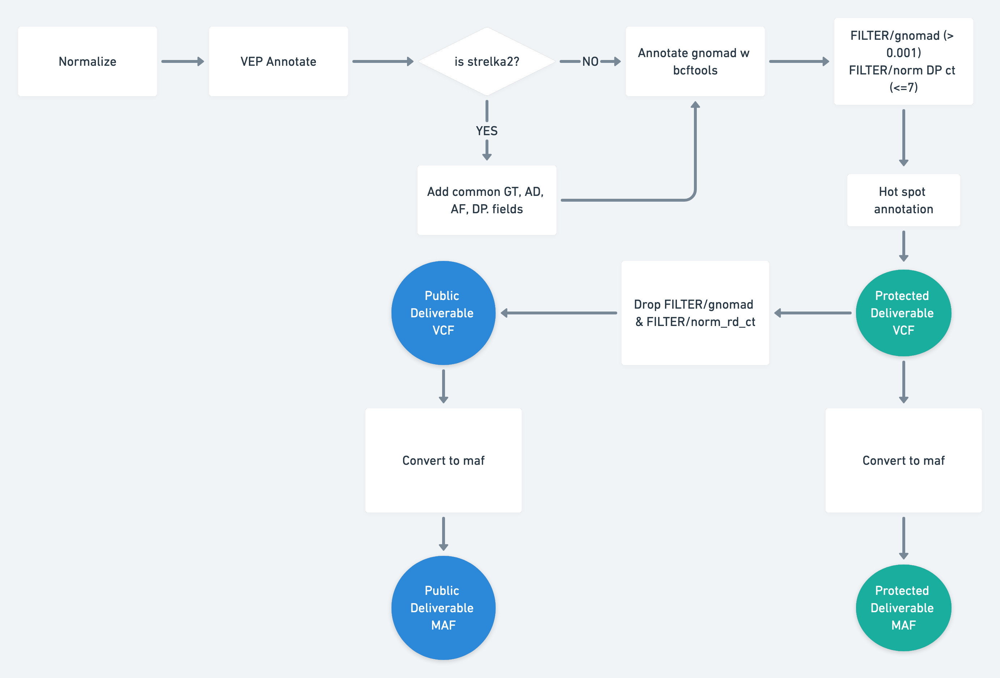

# Kids First DRC Somatic Variant Annotation Workflow
This is a subworkflow that is part of the Kids First DRC Somatic Variant Workflow that can be run as standalone.
Annotation of variant calls helps give context to the possible biological consequences of each variant.



It does the following things as described below:

1. Normalize VCF
1. Strip specified `INFO` and `FORMAT` fields (Only if adding a new annotation that clashes with existing)
1. Annotate with VEP
1. Annotated with an additional vcf - optional, recommend using AF-only WGS gnomad VCF)
1. Soft filter on remarkable variant characteristics
   - KF recommends normal read depth <= 7 and gnomAD AF > 0.001
   - This output will be considered `protected`
1. Annotate with hotspots - KF recommends cancer genome hotspots v2, formatting required and explained below
1. Create MAF output using a modified version of MSKCC's vcf2maf
1. Hard filter on vcf based on user-specified criteria - this output would be considered `public`
1. Create MAF output based on `public` vcf

## Workflow Description and KF Recommended Inputs
The additional gnomAD annotation, hotspot annotation, and soft + hard filtering are part of process called "Germline Masking."
The purpose of this is to create outputs that are safe for public consumption by marking and creating a version of outputs deemed a "germline risk" based on specified criteria.
For KF, based on guidance from the Genomic Data Commons (GDC), this means filtering variants with a normal read depth of <= 7 reads and a gnomAD AF > 0.001.
The gnomAD AF filter is pretty intuitive - gnomAD is a database resource of variants and their estimated prevalence in the human population.
Therefore, a variant that is higher than the recommended threshold can be seen as a higher risk of being a common and identifiable variant, and a lower risk for being disease-causing.
The normal depth argument may be less intuitive to some, and an example might help explain its importance:
You've got a somatic variant candidate, and the normal-sample reads all support the reference allele.
However,  if there are only ~5 of those reads, then there's a decent chance that it's a germline het variant and you just didn't get lucky enough to see any alt reads in the normal sample.
A prior understanding that heterozygous germline variant are much more common than somatic variants informs this.

### General workflow inputs:
```yaml
inputs:
  indexed_reference_fasta: {type: File, secondaryFiles: [.fai, ^.dict]}
  input_vcf: {type: File, secondaryFiles: ['.tbi'], doc: "Input vcf to annotate and soft filter"}
  input_tumor_name: string
  input_normal_name: string
  add_common_fields: {type: boolean, doc: "Set to true if input is a strelka2 vcf that hasn't had common fields added", default: false}
  bcftools_annot_columns: {type: string, doc: "csv string of columns from annotation to port into the input vcf, i.e INFO/AF"}
  bcftools_annot_vcf: {type: File, secondaryFiles: ['.tbi'], doc: "bgzipped annotation vcf file"}
  bcftools_public_filter: {type: string?, doc: "Will hard filter final result to create a public version", default: FILTER="PASS"|INFO/HotSpotAllele=1}
  gatk_filter_name: {type: 'string[]', doc: "Array of names for each filter tag to add"}
  gatk_filter_expression: {type: 'string[]', doc: "Array of filter expressions to establish criteria to tag variants with. See https://gatk.broadinstitute.org/hc/en-us/articles/360036730071-VariantFiltration for clues"}
  vep_cache: {type: File, label: tar gzipped cache from ensembl/local converted cache}
  vep_ref_build: {type: ['null', string], doc: "Genome ref build used, should line up with cache.", default: "GRCh38" }
  disable_hotspot_annotation: { type: 'boolean?', doc: "Disable Hotspot Annotation and skip this task." }
  genomic_hotspots: { type: 'File[]?', doc: "Tab-delimited BED formatted file(s) containing hg38 genomic positions corresponding to hotspots" }
  protein_snv_hotspots: { type: 'File[]?', doc: "Column-name-containing, tab-delimited file(s) containing protein names and amino acid positions corresponding to hotspots" }
  protein_indel_hotspots: { type: 'File[]?', doc: "Column-name-containing, tab-delimited file(s) containing protein names and amino acid position ranges corresponding to hotspots" }
  output_basename: string
  tool_name: string
  retain_info: {type: string?, doc: "csv string with INFO fields that you want to keep, i.e. for consensus `MQ,MQ0,CAL,Hotspot`"}
  retain_fmt: {type: string?, doc: "csv string with FORMAT fields that you want to keep"}
  maf_center: {type: string?, doc: "Sequencing center of variant called", default: "."}
```

### Recommended reference inputs - all file references can be obtained [here](https://cavatica.sbgenomics.com/u/kfdrc-harmonization/kf-references/)
Secondary files needed for each reference file will be a sub-bullet point
 - `indexed_reference_fasta`: `Homo_sapiens_assembly38.fasta`
   - `Homo_sapiens_assembly38.fasta.fai`
   - `Homo_sapiens_assembly38.dict`
 - `bcftools_annot_columns`: "INFO/AF"
 - `bcftools_annot_vcf`: `af-only-gnomad.hg38.vcf.gz`
   - `af-only-gnomad.hg38.vcf.gz.tbi`
 - `bcftools_public_filter`: 'FILTER="PASS"|INFO/HotSpotAllele=1'
 - `gatk_filter_name`: ["NORM_DP_LOW", "GNOMAD_AF_HIGH"]
 - `gatk_filter_expression`: ["vc.getGenotype('insert_normal_sample_name').getDP() <= 7", "AF > 0.001"] # NOTE!! Replace `insert_normal_sample_name` with the value you'd use for `input_normal_name`!
 - `vep_cache`: `homo_sapiens_vep_93_GRCh38.tar.gz`
 - `genomic_hotspots`: `tert.bed` # This file has two common TERT promoter gene hot spots
 - `protein_snv_hotspots`: `protein_snv_cancer_hotspots_v2.tsv` # A tsv formatted SNV + MNV subset of https://www.cancerhotspots.org/files/hotspots_v2.xls
 - `protein_indel_hotspots`: `protein_indel_cancer_hotspots_v2.tsv` # A tsv formatted INDEL subset of https://www.cancerhotspots.org/files/hotspots_v2.xls

### Source-specific inputs
For each input, the sub-bullet refers to when to use the suggested input
 - `add_common_fields`
   - Strelka2 calls: `true`
   - All others: `false`
 - `retain_info` # This is fairly subjective, some useful columns unique from each caller to carry over from VCF to MAF
   - Strelka2: "MQ,MQ0,QSI,HotSpotAllele"
   - Mutect2: "MBQ,TLOD,HotSpotAllele"
   - Lancet: "MS,FETS,HotSpotAllele"
   - Vardict: "MSI,MSILEN,SOR,SSF,HotSpotAllele"
 - `tool_name`:
   - `Strelka2`: `strelka2_somatic`
   - `Mutect2`: `mutect2_somatic`
   - `Lancet`: `lancet_somatic`
   - `VarDict Java`: `vardict_somatic`
