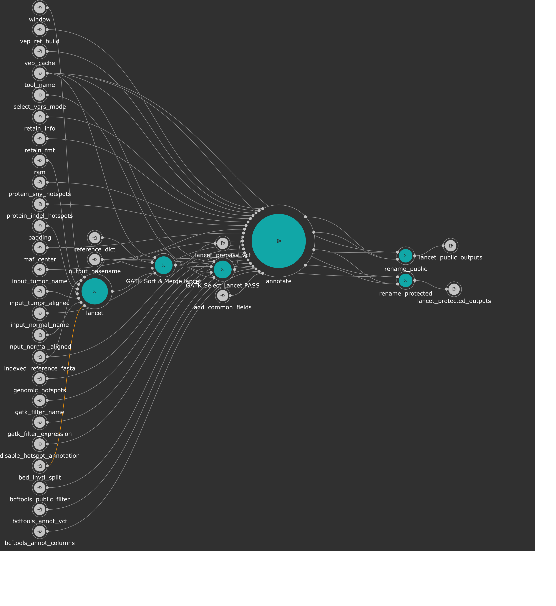

# Kids First DRC Lancet Variant Calling Subworkflow
This is a subworkflow that is part of the Kids First DRC Somatic Variant Workflow that can be run nearly as standalone, with a wrapper that creates scattered interval lists.
Lancet is a variant caller that calls single nucleotide variants, multi-nucleotide variants, and small insertions and deletions.


[This subworkflow](../sub_workflows/kfdrc_lancet_sub_wf.cwl) does the following things as described below:

1. Run the lancet variant caller tool, scattering on the input interval list for greater speed
1. Merge scattered VCF call results. This will constitute the pre-pass VCF
1. Select `PASS` step subsets the pre-pass VCF to `PASS` only
1. Annotate the `PASS` VCF using the [annotation sub workflow](kfdrc_annotation_subworkflow.md) - most relevant information is here!
1. Rename outputs to fit a standard format

## Workflow Description and KF Recommended Inputs
This workflow runs [lancet 1.7.0](https://github.com/nygenome/lancet/tree/v1.0.7) which calls single nucleotide variants (SNV) and insertions/deletions (INDEL)

### General Workflow Inputs
```yaml
inputs:
  indexed_reference_fasta: {type: File, secondaryFiles: [.fai, ^.dict]}
  input_tumor_aligned: {type: File, secondaryFiles: [^.bai]}
  input_tumor_name: string
  input_normal_aligned: {type: File, secondaryFiles: [^.bai]}
  input_normal_name: string
  output_basename: string
  reference_dict: File
  bed_invtl_split: {type: 'File[]', doc: "Bed file intervals passed on from and outside pre-processing step"}
  ram: {type: ['null', int], default: 12, doc: "Adjust in rare circumstances in which 12 GB is not enough."}
  select_vars_mode: {type: ['null', {type: enum, name: select_vars_mode, symbols: ["gatk", "grep"]}], doc: "Choose 'gatk' for SelectVariants tool, or 'grep' for grep expression", default: "gatk"}
  window: {type: int, doc: "window size for lancet.  default is 600, recommend 500 for WGS, 600 for exome+"}
  padding: {type: int, doc: "If WGS (less likely), default 25, if exome+, recommend half window size"}
  tool_name: {type: string?, doc: "String to describe what tool was run as part of file name", default: "lancet_somatic"}

  # VEP params
  vep_cache: {type: 'File', doc: "tar gzipped cache from ensembl/local converted cache",  "sbg:suggestedValue": {class: File, path: 6332f8e47535110eb79c794f,
      name: homo_sapiens_merged_vep_105_indexed_GRCh38.tar.gz}}
  vep_ram: {type: 'int?', default: 32, doc: "In GB, may need to increase this value depending on the size/complexity of input"}
  vep_cores: {type: 'int?', default: 16, doc: "Number of cores to use. May need to increase for really large inputs"}
  vep_buffer_size: {type: 'int?', default: 1000, doc: "Increase or decrease to balance speed and memory usage"}
  dbnsfp: { type: 'File?', secondaryFiles: [.tbi,^.readme.txt], doc: "VEP-formatted plugin file, index, and readme file containing dbNSFP annotations" }
  dbnsfp_fields: { type: 'string?', doc: "csv string with desired fields to annotate. Use ALL to grab all"}
  merged: { type: 'boolean?', doc: "Set to true if merged cache used", default: true }
  cadd_indels: { type: 'File?', secondaryFiles: [.tbi], doc: "VEP-formatted plugin file and index containing CADD indel annotations" }
  cadd_snvs: { type: 'File?', secondaryFiles: [.tbi], doc: "VEP-formatted plugin file and index containing CADD SNV annotations" }
  run_cache_existing: { type: 'boolean?', doc: "Run the check_existing flag for cache" }
  run_cache_af: { type: 'boolean?', doc: "Run the allele frequency flags for cache" }

  # annotation vars
  genomic_hotspots: { type: 'File[]?', doc: "Tab-delimited BED formatted file(s) containing hg38 genomic positions corresponding to hotspots", "sbg:suggestedValue": [{class: File, path: 607713829360f10e3982a423, name: tert.bed}] }
  protein_snv_hotspots: { type: 'File[]?', doc: "Column-name-containing, tab-delimited file(s) containing protein names and amino acid positions corresponding to hotspots", "sbg:suggestedValue": [{class: File, path: 663d2bcc27374715fccd8c6a, name: protein_snv_cancer_hotspots_v2.ENS105_liftover.tsv}] }
  protein_indel_hotspots: { type: 'File[]?', doc: "Column-name-containing, tab-delimited file(s) containing protein names and amino acid position ranges corresponding to hotspots", "sbg:suggestedValue": [{class: File, path: 663d2bcc27374715fccd8c6f, name: protein_indel_cancer_hotspots_v2.ENS105_liftover.tsv}] }
  retain_info: {type: 'string?', doc: "csv string with INFO fields that you want to keep", default: "gnomad_3_1_1_AC,gnomad_3_1_1_AN,gnomad_3_1_1_AF,gnomad_3_1_1_nhomalt,gnomad_3_1_1_AC_popmax,gnomad_3_1_1_AN_popmax,gnomad_3_1_1_AF_popmax,gnomad_3_1_1_nhomalt_popmax,gnomad_3_1_1_AC_controls_and_biobanks,gnomad_3_1_1_AN_controls_and_biobanks,gnomad_3_1_1_AF_controls_and_biobanks,gnomad_3_1_1_AF_non_cancer,gnomad_3_1_1_primate_ai_score,gnomad_3_1_1_splice_ai_consequence,MBQ,TLOD,HotSpotAllele"}
  retain_fmt: {type: 'string?', doc: "csv string with FORMAT fields that you want to keep"}
  retain_ann: { type: 'string?', doc: "csv string of annotations (within the VEP CSQ/ANN) to retain as extra columns in MAF", default: "HGVSg" }
  echtvar_anno_zips: {type: 'File[]?', doc: "Annotation ZIP files for echtvar anno"}
  bcftools_strip_columns: {type: 'string?', doc: "csv string of columns to strip if needed to avoid conflict, i.e INFO/AF"}
  bcftools_public_filter: {type: 'string?', doc: "Will hard filter final result to create a public version", default: FILTER="PASS"|INFO/HotSpotAllele=1}
  gatk_filter_name: {type: 'string[]', doc: "Array of names for each filter tag to add, recommend: [\"NORM_DP_LOW\", \"GNOMAD_AF_HIGH\"]"}
  gatk_filter_expression: {type: 'string[]', doc: "Array of filter expressions to establish criteria to tag variants with. See https://gatk.broadinstitute.org/hc/en-us/articles/360036730071-VariantFiltration, recommend: \"vc.getGenotype('\" + inputs.input_normal_name + \"').getDP() <= 7\"), \"gnomad_3_1_1_AF != '.' && gnomad_3_1_1_AF > 0.001\"]"}
  disable_hotspot_annotation: { type: 'boolean?', doc: "Disable Hotspot Annotation and skip this task.", default: false }
  maf_center: {type: 'string?', doc: "Sequencing center of variant called", default: "."}
```
### Recommended reference inputs - all file references can be obtained [here](https://cavatica.sbgenomics.com/u/kfdrc-harmonization/kf-references/)*
Secondary files needed for each reference file will be a sub-bullet point.
* For recommendations for inputs in the `#annotation` section, see the [annotation subworkflow docs.](../docs/kfdrc_annotation_subworkflow.md)
 - `indexed_reference_fasta`: `Homo_sapiens_assembly38.fasta`
   - `Homo_sapiens_assembly38.fasta.fai`
   - `Homo_sapiens_assembly38.dict`
 - `reference_dict`: `Homo_sapiens_assembly38.dict`
 - `bed_invtl_split`: an array of bed intervals, would be created by a wrapper workflow
 - `echtvar_anno_zips`: `gnomad_3_1_1.vwb_subset.echtvar_0_1_9.zip`

### Source-specific inputs
 - `window`
   - `600`: exome+ mode (see [wrapper workflow for explanation](../docs/kfdrc_lancet_standalone_wf.md#extended_use_case) )
   - `500`: If run as pure WGS. Not recommended for performance reasons, see [wrapper workflow for explanation](../docs/kfdrc_lancet_standalone_wf.md#extended_use_case)
 - `padding`
   - `300` or half window size used if exome+
   - `25` if pure WGS
### Workflow performance tuning
Occasionally, default memory values may not suffice to process the inputs.
Edit where needed to unblock these steps.
All memory units are in whole GB
```yaml
  ram: {type: int?} # memory used for each lancet scatter task
```
## Workflow outputs
```yaml
outputs:
  lancet_prepass_vcf: {type: File, outputSource: sort_merge_lancet_vcf/merged_vcf}
  lancet_protected_outputs: {type: 'File[]', outputSource: rename_protected/renamed_files}
  lancet_public_outputs: {type: 'File[]', outputSource: rename_public/renamed_files}
```

 - `lancet_prepass_vcf`: VCF with SNV, MNV, and INDEL variant calls. Contains all soft `FILTER` values generated by variant caller, Use this file if you believe important variants are being left out when using the algorithm's `PASS` filter
 - `lancet_protected_outputs`: Array of files containing MAF format of PASS hits, `PASS` VCF with annotation pipeline soft `FILTER`-added values, and VCF index
 - `lancet_public_outputs`: Same as above, except MAF and VCF have had entries with soft `FILTER` values removed
