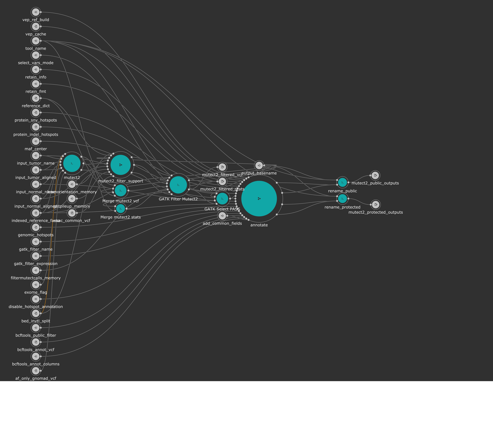

# Kids First DRC GATK Mutect2 Variant Calling Subworkflow
This is a subworkflow that is part of the Kids First DRC Somatic Variant Workflow that can be run as standalone.
Mutect2 is a variant caller that calls single nucleotide variants, multi-nucleotide variants,  and small insertions and deletions.


[This subworkflow](../sub_workflows/kfdrc_mutect2_sub_wf.cwl) does the following things as described below:

1. Run the Mutect2 variant caller tool, scattering on the input interval list for greater speed
1. Filter tables are created using steps as outlined in [section II](https://github.com/broadinstitute/gatk/blob/master/docs/mutect/mutect.pdf) of this documentation
1. Scattered mutect2 VCF results are merged into a single VCF
1. Stats tables from Mutect2 run are merged
1. Merged stats table and outputs from filter tables are used to populate the `FILTER` attribute in the merged Mutect2 VCF. This creates the pre-pass VCF containing `PASS` and variants with various failing-to-pass criteria in the `FILTER` field
1. Select `PASS` step subsets the pre-pass VCF to `PASS` only
1. Annotate the `PASS` VCF using the [annotation sub workflow](kfdrc_annotation_subworkflow.md) - most relevant information is here!
1. Rename outputs to fit a standard format

## Workflow Description and KF Recommended Inputs
This workflow runs [Mutect2 4.1.1.0](https://gatk.broadinstitute.org/hc/en-us/articles/360036730411-Mutect2) which calls single nucleotide variants (SNV) and insertions/deletions (INDEL).

### General Workflow Inputs
```yaml
inputs:
  indexed_reference_fasta: {type: File, secondaryFiles: [.fai, ^.dict]}
  reference_dict: File
  bed_invtl_split: {type: 'File[]', doc: "Bed file intervals passed on from and outside pre-processing step"}
  af_only_gnomad_vcf: {type: File, secondaryFiles: ['.tbi']}
  exac_common_vcf: {type: File, secondaryFiles: ['.tbi']}
  input_tumor_aligned:
    type: File
    secondaryFiles: |
      ${
        var dpath = self.location.replace(self.basename, "")
        if(self.nameext == '.bam'){
          return {"location": dpath+self.nameroot+".bai", "class": "File"}
        }
        else{
          return {"location": dpath+self.basename+".crai", "class": "File"}
        }
      }
    doc: "tumor BAM or CRAM"

  input_tumor_name: string
  input_normal_aligned:
    type: File
    secondaryFiles: |
      ${
        var dpath = self.location.replace(self.basename, "")
        if(self.nameext == '.bam'){
          return {"location": dpath+self.nameroot+".bai", "class": "File"}
        }
        else{
          return {"location": dpath+self.basename+".crai", "class": "File"}
        }
      }
    doc: "normal BAM or CRAM"

  input_normal_name: string
  exome_flag: {type: ['null', string], doc: "set to 'Y' for exome mode"}
  vep_cache: {type: File, doc: "tar gzipped cache from ensembl/local converted cache"}
  vep_ref_build: {type: ['null', string], doc: "Genome ref build used, should line up with cache.", default: "GRCh38" }
  output_basename: string
  getpileup_memory: {type: int?}
  learnorientation_memory: {type: int?}
  filtermutectcalls_memory: {type: int?}
  select_vars_mode: {type: ['null', {type: enum, name: select_vars_mode, symbols: ["gatk", "grep"]}], doc: "Choose 'gatk' for SelectVariants tool, or 'grep' for grep expression", default: "gatk"}
  tool_name: {type: string?, doc: "String to describe what tool was run as part of file name", default: "mutect2_somatic"}
  # annotation vars
  genomic_hotspots: { type: 'File[]?', doc: "Tab-delimited BED formatted file(s) containing hg38 genomic positions corresponding to hotspots" }
  protein_snv_hotspots: { type: 'File[]?', doc: "Column-name-containing, tab-delimited file(s) containing protein names and amino acid positions corresponding to hotspots" }
  protein_indel_hotspots: { type: 'File[]?', doc: "Column-name-containing, tab-delimited file(s) containing protein names and amino acid position ranges corresponding to hotspots" }
  retain_info: {type: string?, doc: "csv string with INFO fields that you want to keep", default: "MBQ,TLOD,HotSpotAllele"}
  retain_fmt: {type: string?, doc: "csv string with FORMAT fields that you want to keep"}
  add_common_fields: {type: boolean?, doc: "Set to true if input is a strelka2 vcf that hasn't had common fields added", default: false}
  bcftools_annot_columns: {type: string, doc: "csv string of columns from annotation to port into the input vcf, i.e INFO/AF", default: "INFO/AF"}
  bcftools_annot_vcf: {type: File, secondaryFiles: ['.tbi'], doc: "bgzipped annotation vcf file"}
  bcftools_public_filter: {type: string?, doc: "Will hard filter final result to create a public version", default: FILTER="PASS"|INFO/HotSpotAllele=1}
  gatk_filter_name: {type: 'string[]', doc: "Array of names for each filter tag to add, recommend: [\"NORM_DP_LOW\", \"GNOMAD_AF_HIGH\"]"}
  gatk_filter_expression: {type: 'string[]', doc: "Array of filter expressions to establish criteria to tag variants with. See https://gatk.broadinstitute.org/hc/en-us/articles/360036730071-VariantFiltration, recommend: \"vc.getGenotype('\" + inputs.input_normal_name + \"').getDP() <= 7\"), \"AF > 0.001\"]"}
  disable_hotspot_annotation: { type: 'boolean?', doc: "Disable Hotspot Annotation and skip this task.", default: false }
  maf_center: {type: string?, doc: "Sequencing center of variant called", default: "."}
```

### Recommended reference inputs - all file references can be obtained [here](https://cavatica.sbgenomics.com/u/kfdrc-harmonization/kf-references/)*
Secondary files needed for each reference file will be a sub-bullet point.
* For recommendations for inputs in the `#annotation` section, see the [annotation subworkflow docs.](../sub_workflows/kfdrc_strelka2_sub_wf.cwl)
 - `indexed_reference_fasta`: `Homo_sapiens_assembly38.fasta`
   - `Homo_sapiens_assembly38.fasta.fai`
   - `Homo_sapiens_assembly38.dict`
 - `reference_dict`: `Homo_sapiens_assembly38.dict`
 - `hg38_strelka_bed`: `hg38_strelka.bed.gz`
 - `bed_invtl_split`: an array of bed intervals, would be created by a wrapper workflow
 - `af_only_gnomad_vcf`: `af-only-gnomad.hg38.vcf.gz`
   - `af-only-gnomad.hg38.vcf.gz.tbi`
 - `exac_common_vcf`: `small_exac_common_3.hg38.vcf.gz`
   - `small_exac_common_3.hg38.vcf.gz.tbi`


### Source-specific inputs
 - `exome_flag`
   - `Y` if exome
   - `N` or leave blank if WGS

### Worflow performance tuning
Occassionally, default memory values may not suffice to process the inputs.
Edit where needed to unblock these steps.
All memory units are in whole GB
```yaml
  getpileup_memory: {type: int?}
  learnorientation_memory: {type: int?}
  filtermutectcalls_memory: {type: int?}
```

## Workflow outputs
```yaml
outputs:
  mutect2_filtered_stats: {type: File, outputSource: filter_mutect2_vcf/stats_table}
  mutect2_filtered_vcf: {type: File, outputSource: filter_mutect2_vcf/filtered_vcf}
  mutect2_protected_outputs: {type: 'File[]', outputSource: rename_protected/renamed_files}
  mutect2_public_outputs: {type: 'File[]', outputSource: rename_public/renamed_files}
```

 - `mutect2_filtered_stats`: 
 - `mutect2_filtered_vcf`: VCF with SNV, MNV, and INDEL variant calls. Contains all soft `FILTER` values generated by variant caller
 - `mutect2_protected_outputs`: Array of files containing MAF format of PASS hits, `PASS` VCF with annotation pipeline soft `FILTER`-added values, and VCF index
 - `mutect2_public_outputs`: Same as above, except MAF and VCF have had entries with soft `FILTER` values removed
